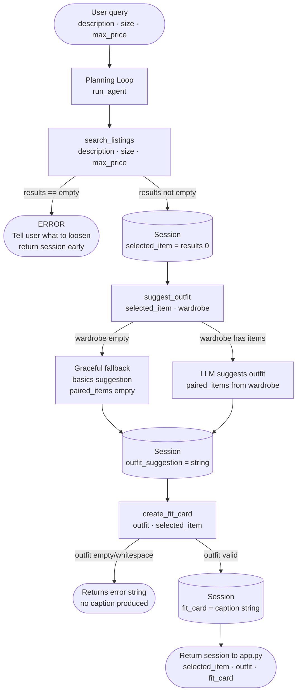

# FitFindr — planning.md

> Complete this document before writing any implementation code.
> Your spec and agent diagram are what you'll use to direct AI tools (Claude, Copilot, etc.) to generate your implementation — the more specific they are, the more useful the generated code will be.
> Your planning.md will be reviewed as part of your submission.
> Update it before starting any stretch features.

---

## Tools

List every tool your agent will use. For each tool, fill in all four fields.
You must have at least 3 tools. The three required tools are listed — add any additional tools below them.

### Tool 1: search_listings

**What it does:**
Searches the 40 mock listings for items matching a free-text description, within a requested size and a maximum price, and returns the matches ranked best-first. It's the entry point — no other tool runs until this returns results.

**Input parameters:**
- `description` (str): plain-text of what the user wants (e.g. "vintage graphic tee"). Matched case-insensitively against each listing's title + description + style_tags combined.
- `size` (str): requested size (e.g. "M"). Flexible match — a listing qualifies if its size field contains the requested token (so "M" also catches "S/M", "M/L") or the listing is "One Size".
- `max_price` (float): inclusive price ceiling. A listing qualifies if its price <= max_price.

**What it returns:**
A list of listing dicts, each carrying the full field set (id, title, description, category, style_tags, size, condition, price, colors, brand, platform), sorted by relevance (count of query words matched, cheaper-first as tiebreak). The planning loop takes results[0] as selected_item. Returns an empty list ([]) when nothing matches — never None, never raises.

**What happens if it fails or returns nothing:**
Returns []. The planning loop detects the empty list, does not call suggest_outfit, and tells the user what to loosen (e.g. "No listings matched 'vintage graphic tee' in size M under $30 — try raising your max price or dropping the size filter"). Stretch hook: on empty, retry once with the size filter removed before giving up.

---

### Tool 2: suggest_outfit

**What it does:**
Takes the found item plus the user's wardrobe and proposes a complete outfit — which existing pieces to pair it with and a short styling note. The LLM (Groq llama-3.3-70b) does the compatibility reasoning over the shared category, colors, and style_tags fields.

**Input parameters:**
- `new_item` (dict): one full listing dict — the selected_item the loop pulled from search_listings.
- `wardrobe` (dict): the {"items": [...]} structure, each item with id, name, category, colors, style_tags, notes.

**What it returns:**
A non-empty str — the styling suggestion (e.g. "Pair with your baggy straight-leg jeans and chunky white sneakers for a 90s look; tuck the front corner slightly for shape."). String, not a dict, to match the tools.py stub and so it can flow directly into create_fit_card(outfit: str). On LLM/API error, returns a safe fallback string — never None, never raises.

**What happens if it fails or returns nothing:**
Empty wardrobe (get_empty_wardrobe): detected before calling the LLM — returns a deterministic general-styling string built on staples (plain top, straight/wide-leg jeans, neutral shoes) that names the new item and flags that the closet is empty. Returning deterministically (no LLM) keeps this failure mode fast and offline-testable. LLM/API failure on the non-empty path: caught, returns a safe fallback string so the agent stays useful.

---

### Tool 3: create_fit_card

**What it does:**
Generates a short, casual, first-person caption (Instagram-style, emoji ok) for the complete look. The LLM writes the caption from the outfit suggestion string and listing details — different inputs produce genuinely different captions, not a template (higher temperature for variety).

**Input parameters:**
- `outfit` (str): the styling-suggestion string returned by suggest_outfit.
- `new_item` (dict): the full listing dict, so the caption can reference price, platform, and brand. brand may be None — handle gracefully by omitting it rather than printing "None".

**What it returns:**
A str — the caption text ready to share. Example: "thrifted this faded band tee off depop for $22 and it was made for my wide-legs 🖤". Never None, never raises.

**What happens if it fails or returns nothing:**
If outfit is empty or whitespace-only, returns a descriptive error string ("Couldn't generate a fit card — the outfit suggestion was empty or missing.") rather than a caption — a fit card for a missing outfit would be misleading. On LLM/API error with a valid outfit, also returns an error string rather than raising.

---

### Additional Tools (if any)

<!-- Copy the block above for any tools beyond the required three -->

---

## Planning Loop

**How does your agent decide which tool to call next?**
The loop runs as a coded conditional pipeline — the agent checks what came back from each tool before deciding the next step. No tool is called in a fixed sequence regardless of context.

Step-by-step logic:

1. Parse the query into description, size, and max_price; store in session["parsed"].

2. Call search_listings(description, size, max_price); store in session["search_results"].
   - Check: if search_results == [] → write error message to session["error"], return session early. Do NOT proceed to suggest_outfit.
   - Otherwise: set session["selected_item"] = search_results[0]. Continue.

3. Call suggest_outfit(session["selected_item"], session["wardrobe"]).
   - Always runs if step 2 succeeded (suggest_outfit handles its own empty-wardrobe case gracefully and always returns a non-empty string).
   - Set session["outfit_suggestion"] = return value. Continue.

4. Call create_fit_card(session["outfit_suggestion"], session["selected_item"]).
   - create_fit_card guards an empty/whitespace outfit internally and returns an error string instead of crashing.
   - Set session["fit_card"] = return value. Continue.

5. Return the full session to the caller.

The agent knows it's done when either: (a) it hits the early-return error path after an empty search, or (b) session["fit_card"] is populated and it reaches step 5.

---

## State Management

**How does information from one tool get passed to the next?**
A single session dict is created at the start of each agent run and passed through every step. Each tool writes its output into the dict; the next tool reads from it — the user never re-enters anything.

Session structure (matches _new_session in agent.py):
```python
session = {
    "query": query,              # original user query string
    "parsed": {},                # extracted description / size / max_price
    "search_results": [],        # list of matching listing dicts from search_listings
    "selected_item": None,       # top result, passed into suggest_outfit
    "wardrobe": wardrobe,        # user's wardrobe dict
    "outfit_suggestion": None,   # str returned by suggest_outfit
    "fit_card": None,            # str returned by create_fit_card
    "error": None                # set if the interaction ended early
}
```

Data flow:
- query → parse → session["parsed"] (description, size, max_price)
- session["parsed"] → search_listings → session["search_results"]; results[0] → session["selected_item"]
- session["selected_item"] + session["wardrobe"] → suggest_outfit → session["outfit_suggestion"] (str)
- session["outfit_suggestion"] + session["selected_item"] → create_fit_card → session["fit_card"] (str)

The full session is returned at the end so the caller (app.py) can display whichever fields are populated and surface the error message if one was set.

---

## Error Handling

For each tool, describe the specific failure mode you're handling and what the agent does in response.

| Tool | Failure mode | Agent response |
|------|-------------|----------------|
| search_listings | No results match the query | Returns []. Loop detects empty list, sets session["error"] = "No listings matched '{description}' in size {size} under ${max_price} — try raising your max price or dropping the size filter.", returns session early. suggest_outfit is never called. |
| suggest_outfit | Wardrobe is empty (items: []) | Detected before calling the LLM. Returns a deterministic general-styling string that names the new item, suggests staples (plain top, straight/wide-leg jeans, neutral shoes), and notes the closet is empty. Non-empty string, no crash; flow continues to create_fit_card. |
| create_fit_card | Outfit string is empty or whitespace-only | Returns a descriptive error string: "Couldn't generate a fit card — the outfit suggestion was empty or missing." No caption is produced and no exception is raised, since a fit card for a missing outfit would be misleading. |

---

## Architecture



---

## AI Tool Plan

<!-- For each part of the implementation below, describe:
     - Which AI tool you plan to use (Claude, Copilot, ChatGPT, etc.)
     - What you'll give it as input (which sections of this planning.md, your agent diagram)
     - What you expect it to produce
     - How you'll verify the output matches your spec before moving on

     "I'll use AI to help me code" is not a plan.
     "I'll give Claude my Tool 1 spec (inputs, return value, failure mode) and ask it to implement
     search_listings() using load_listings() from the data loader — then test it against 3 queries
     before trusting it" is a plan. -->

**Milestone 3 — Individual tool implementations:**

For each tool I'll give Claude the corresponding Tool spec block from this planning.md (what it does, inputs, return value, failure mode) plus the relevant data_loader.py helper. I'll ask it to implement the function in tools.py and verify before using it.

- search_listings: Give Claude the Tool 1 spec + load_listings() from data_loader.py. Expect it to implement filtering (description match across title+description+style_tags, flexible size match, max_price check) and relevance sorting. Verify by running 3 manual test queries: one that should return results, one that should return [], and one with a size like "M" that should also catch "S/M" listings.

- suggest_outfit: Give Claude the Tool 2 spec + the wardrobe schema + the Groq API setup from tools.py. Expect it to build a prompt that feeds the LLM both the new_item fields and the wardrobe items, then returns the LLM's reply as a string. Verify by running it with get_example_wardrobe() (check it names real wardrobe pieces) and get_empty_wardrobe() (check it returns the general-styling string without calling the LLM).

- create_fit_card: Give Claude the Tool 3 spec + an example suggest_outfit return string. Expect a function that builds a caption prompt from the outfit string + new_item fields (handling brand=None), calls the LLM at higher temperature, and returns a plain string. Verify by running it twice with different inputs and confirming the captions differ. Also test with an empty/whitespace outfit and confirm it returns the guard error string.

**Milestone 4 — Planning loop and state management:**

Give Claude the Planning Loop section, the State Management section, and the Architecture diagram from this planning.md. Expect it to implement the run_agent() function in agent.py that initialises the session dict, calls each tool in order with the conditional checks described, writes results to session after each step, and returns the full session. Verify by tracing through the complete interaction walkthrough below manually against the generated code — confirm early-stop fires on empty search, session fields populate in the right order, and the fit card appears at the end.

---

## A Complete Interaction (Step by Step)

Write out what a full user interaction looks like from start to finish — tool call by tool call. Use a specific example query.

**What FitFindr does (in short):** FitFindr takes a natural-language thrift request and routes it through three tools in order. The request triggers `search_listings`, which filters the 40 listings by description, size, and max price; if matches come back, the top one flows into `suggest_outfit`, which pairs it against the user's wardrobe by category and style, and that suggestion flows into `create_fit_card`, which writes a shareable caption. If `search_listings` finds nothing, FitFindr stops and tells the user what to loosen — it never hands an empty result to the next tool.

**Example user query:** "I'm looking for a vintage graphic tee under $30. I mostly wear baggy jeans and chunky sneakers. What's out there and how would I style it?"

**Step 1:**
Planning loop calls search_listings(description="vintage graphic tee", size="M", max_price=30.0). The function loads all 40 listings, filters to those where "vintage" or "graphic" or "tee" appear in title+description+style_tags combined, size contains "M" or is "One Size", and price <= 30.0. Returns a list of matching dicts sorted by relevance score. Loop checks: results is not empty → sets session["selected_item"] = results[0], e.g. {"id": "lst_012", "title": "Faded Band Tee", "price": 22.0, "platform": "depop", "brand": null, "size": "M", ...}.

**Step 2:**
Planning loop calls suggest_outfit(new_item=session["selected_item"], wardrobe=get_example_wardrobe()). Wardrobe has 10 items — not empty, so the LLM is called. Prompt tells it the new item is a faded band tee (vintage, streetwear tags) and lists the wardrobe pieces. Returns a string: "Pair with your baggy straight-leg jeans and chunky white sneakers for a 90s streetwear look — tuck the front corner slightly for shape." Loop sets session["outfit_suggestion"] = that string.

**Step 3:**
Planning loop calls create_fit_card(outfit=session["outfit_suggestion"], new_item=session["selected_item"]). outfit is a non-empty string — valid input. brand is null so it's omitted from the caption. LLM writes a caption. Tool returns: "thrifted this faded band tee off depop for $22 and it was literally made for my wide-legs 🖤 full look in my stories". Loop sets session["fit_card"] = that string.

**Final output to user:**
The session is returned to app.py, which displays:
- The found listing: "Faded Band Tee — $22, depop, condition: good"
- The outfit suggestion: "Pair with your baggy straight-leg jeans and chunky white sneakers for a 90s streetwear look — tuck the front corner slightly for shape."
- The fit card: "thrifted this faded band tee off depop for $22 and it was literally made for my wide-legs 🖤 full look in my stories"

Error path (not shown above): if step 1 returns [], the user sees: "No listings matched 'vintage graphic tee' in size M under $30 — try raising your max price or dropping the size filter." Steps 2 and 3 are never called.
